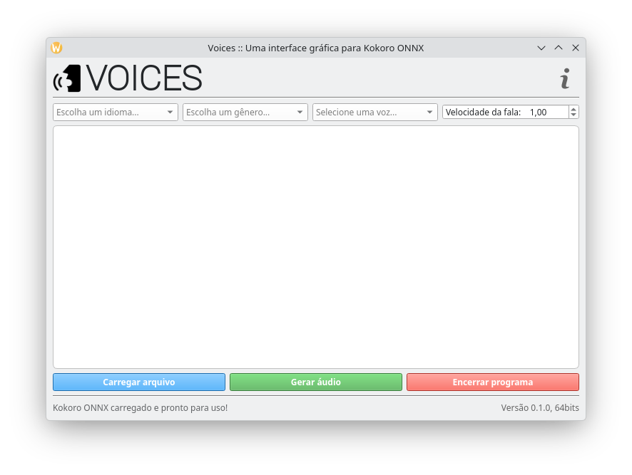
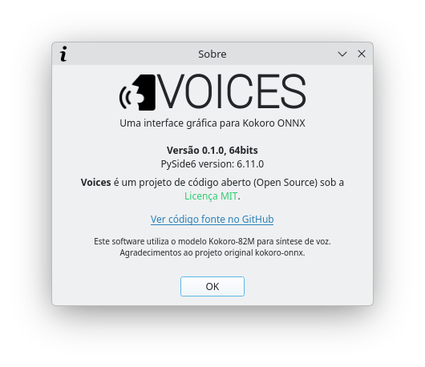

<p align="center">
  
</p>

<h1 align="center">VOICES</h1>

<p align="center">
  
  
  <a href="LICENSE">
    
  </a>
</p>

<p align="center">
  Uma interface gráfica amigável para o motor de síntese de voz <b>Kokoro ONNX</b>.
</p>

> [!WARNING]
> **Compatibilidade de Versão:** Este projeto foi desenvolvido e homologado especificamente para o **Python 3.12.13**. Versões muito recentes do Python (como a **Python 3.14.4**) ainda não possuem suporte das bibliotecas do ecossistema Kokoro e farão o programa falhar.

---

## 💻 Sobre o Projeto

O **VOICES** é uma ferramenta de código aberto que fornece uma interface visual para o modelo de texto-para-fala (TTS) Kokoro ONNX. Com ele, você pode gerar vozes neurais realistas localmente em seu computador de forma simples e direta.

### ✨ Características
* **Interface Intuitiva:** Fácil de usar, ideal para usuários que não querem usar o terminal.
* **Uso Offline:** Após a configuração inicial, o processamento é feito 100% na sua máquina, sem necessidade de internet.
* **Multiplataforma:** Compatível com Linux e Windows.

---

## 📸 Demonstração

### Interface Principal
<p align="center">
  
</p>

### Sobre o Programa
<p align="center">
  
</p>

---

## 🚀 Pré-requisitos

Antes de executar o VOICES, você **deve** ter o `espeak-ng` instalado no seu sistema.

### 🐧 No Linux

* **Arch Linux:**
  ```bash
  sudo pacman -S espeak-ng
  ```
* **Ubuntu / Debian / Mint:**
  ```bash
  sudo apt install espeak-ng
  ```
* **Fedora:**
  ```bash
  sudo dnf install espeak-ng
  ```

### 🪟 No Windows

1. Baixe o instalador oficial na [página de releases do espeak-ng](https://github.com/espeak-ng/espeak-ng/releases).
2. Execute a instalação padrão.

---

## 🛠️ Primeiro Uso

1. Abra o **VOICES** pela primeira vez.
2. Um aviso solicitará o download do motor neural **Kokoro ONNX**.
3. Clique no botão **"Download"** e aguarde a conclusão. 
4. *Nota: Este processo pode demorar alguns minutos dependendo da sua conexão. Nas próximas vezes, o programa iniciará instantaneamente de forma offline.*

---

## 🤝 Agradecimentos

Este projeto só é possível graças ao trabalho incrível dos seguintes projetos de código aberto:

* [espeak-ng](https://github.com/espeak-ng/espeak-ng) - Motor de fala de código aberto.
* [kokoro-onnx](https://github.com/thewh1teagle/kokoro-onnx) - Wrapper ONNX para o modelo Kokoro.

---

## 📄 Licença

Este projeto é software livre e está licenciado sob a [Licença MIT](LICENSE).
